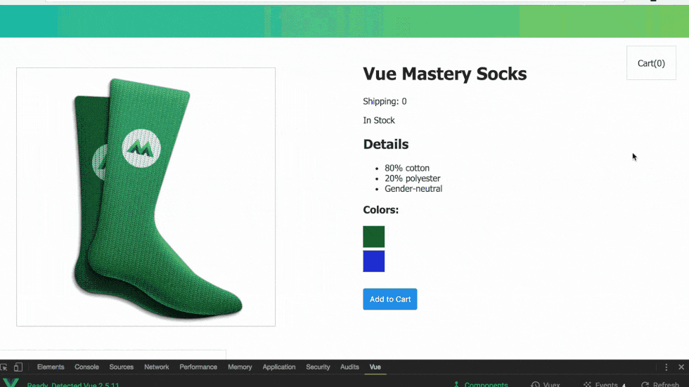

# Intro to Vue
Learn the fundamentals of Vue while we build socks product page.

We use:
* The Vue Instance
* Attribute Binding
* Conditional Rendering
* List Rendering
* Event Handling
* Class & Style Binding
* Computed Properties
* Components
* Communicating Events
* Forms
